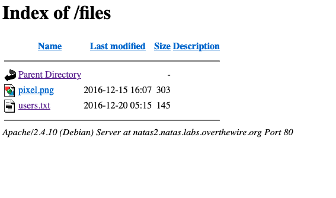

# Natas2

Username: natas2
Password: ZluruAthQk7Q2MqmDeTiUij2ZvWy2mBi
URL:      http://natas2.natas.labs.overthewire.org

# Walkthrough

After accessing the webpage, I am presented with a message:

```
 There is nothing on this page
```

I then look at the source code. I notice a file 

```html
There is nothing on this page

```

I decide to look at the directory `files/`.

I see: 



I click on `users.txt`

And there I have all the passwords:

```
# username:password
alice:BYNdCesZqW
bob:jw2ueICLvT
charlie:G5vCxkVV3m
natas3:sJIJNW6ucpu6HPZ1ZAchaDtwd7oGrD14
eve:zo4mJWyNj2
mallory:9urtcpzBmH
```

# Password

`sJIJNW6ucpu6HPZ1ZAchaDtwd7oGrD14`
